# CN-Lab-5thSem
These are all the programs I wrote in my Computer Networks Lab in 5th Semester.

## Lab 1 | 30-07-2024

<details><summary>1. Find the IP address of your computer. Try connecting to different service providers and notice
the changes, if any, in the IP address of your machine.</summary>

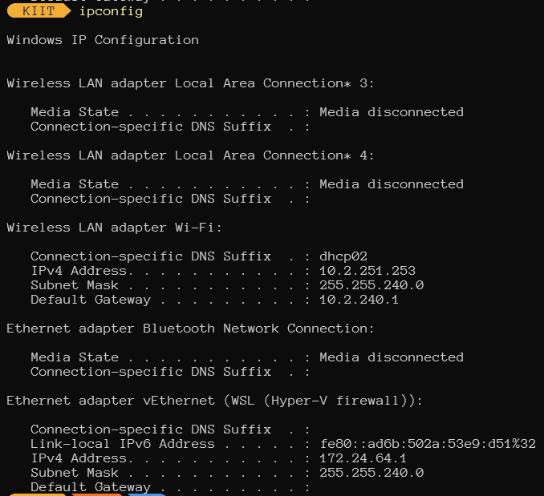

</details>

<details><summary>2. Run traceroute via two or more service providers for www.kiit.ac.in and report your
observations, like if some paths default to IPv6 then how can you force traceroute to use IPv4,
any private IP addresses routers that do not reply to requests, etc.</summary>

1. Normal `tracert`
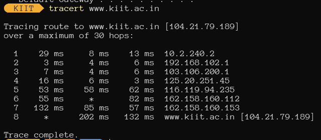

2. `tracert` defaulted to use IPv4
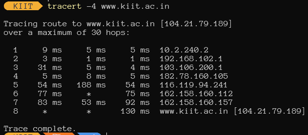

</details>

<details><summary>3. How can you limit the number of hops to 10 in a traceroute command?</summary>

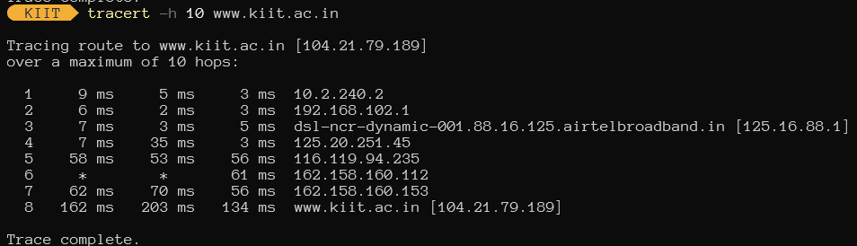

</details>

<details><summary>4. How can you display statistics for all protocols using the netstat command?</summary>

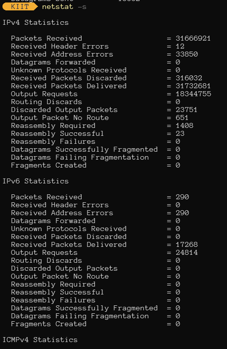

</details>

<details><summary>5. Use nslookup to find the IP Address of `www.kiit.ac.in` and `www.facebook.com`</summary>

1. `www.kiit.ac.in`
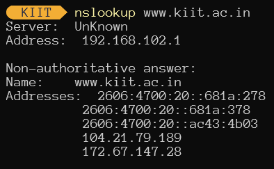

2. `www.facebook.com`
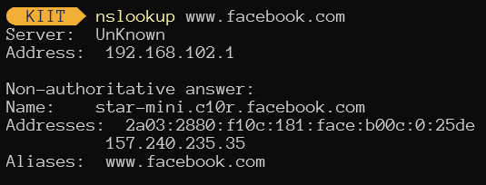

</details>

<details><summary>6. How can you perform a reverse DNS lookup to find the domain name associated with the IP
address 8.8.8.8?</summary>

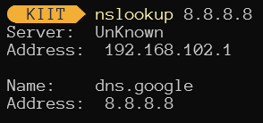

</details>

<details><summary>7. How can you use nslookup to query www.example.com using the DNS server at 8.8.8.8?</summary>

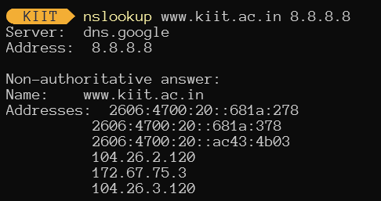

</details>

<details><summary>8. How do you use the ipconfig command to display all current TCP/IP network configurations?</summary>


</details>

<details><summary>9. What are the ipconfig commands to release and renew an IP address on a Windows
machine?</summary>

1. release
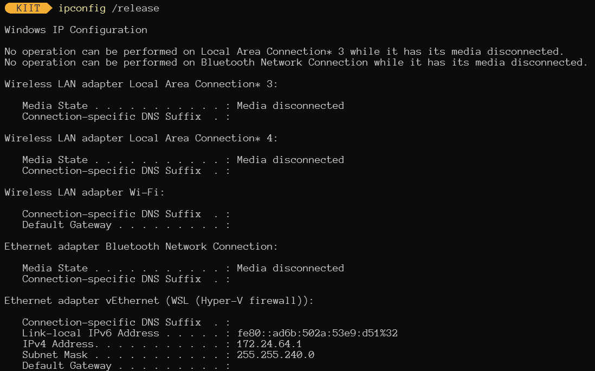

2. renew
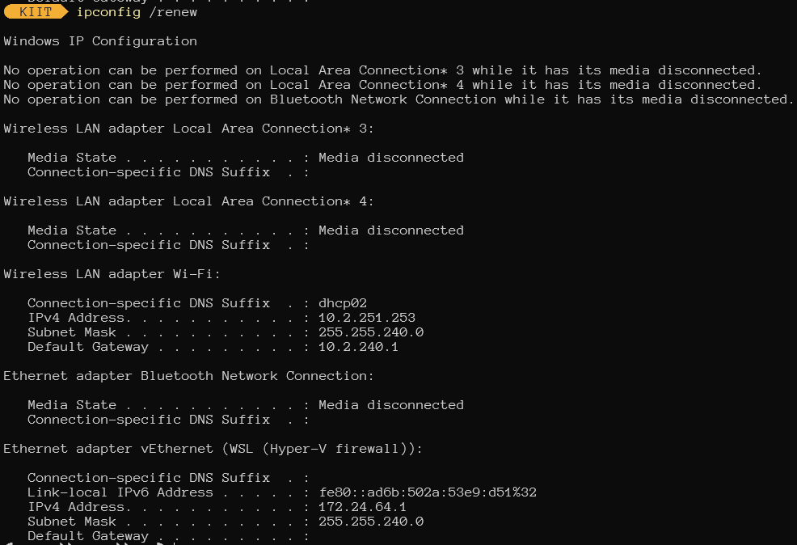

3. flush dns
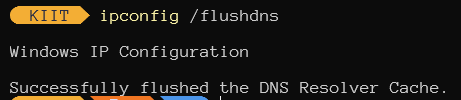

</details>

## Lab 2 | 06-08-2024

1. `swap.c` Write a program in C to swap two numbers using pointer.
2. `structure.c` Write a C program to assign values to each members of the following structure. Pass the populated structure to a function using call-by address and print the value of each member of the structure.
```c
struct info {
    int roll_no;
    char name[50];
    float CGPA;
};
```
3. `extractbyte.c` Write a C program to extract a byte from an integer (user input) value and store them in character variables and print the content of those variables.

4. `disectpkt.c` Write a C program to enter a number and store the number across the following structure and print the content of each member of the structure. Then aggregate each member of the structure to form the original number.
```c
struct pkt {
    char ch1;
    char ch2[2];
    char ch3;
};
```
5. `lilbigendian.c` Write a C program to check whether the Host machine is Little Endian or Big Endian. Enter a number, print the content of each byte location and convert the endianess of the same.

## Lab 3 | 13-08-2024

1. `Prog1\` Write a C program for UDP to create a socket and display if the socket is created successfully or not. Using this socket, apply bind() to associate an IP address and port number and display if the socket is bound successfully else display the error message.
2. `Prog2\` Write a C program in UDP to send a message `"Hello KIIT"` from client to server. Display the message on the server side.
3. `Prog3\` Write a C program in UDP to send a message `"Thank you!!!"` from server to client. Display the message on the client side.
4. `Prog4\` Write a program to pass a string from client to server. Display the lower case message in the server. Further, convert the message from lower case to upper case and display the converted message in client side.

## Lab 4 | 20-08-2024

1. `Prog1\` Write a program to pass a string from client to server. Display the string in server side. Further, find the reverse of the string and send the same to the client and display the reversed string in client side.