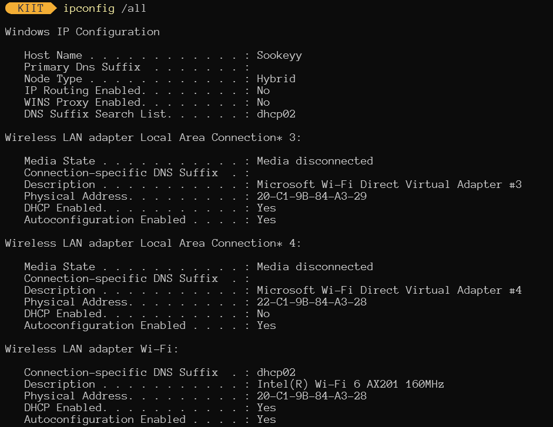

# CN-Lab-5thSem
These are all the programs I wrote in my Computer Networks Lab in 5th Semester.

## Lab 2 | 30-07-2024

<a href="https://Example.com">1. Find the IP address of your computer. Try connecting to different service providers and notice
the changes, if any, in the IP address of your machine.</a>

<a href="https://Example.com">2. Run traceroute via two or more service providers for www.kiit.ac.in and report your
observations, like if some paths default to IPv6 then how can you force traceroute to use IPv4,
any private IP addresses routers that do not reply to requests, etc.</a>

1. Normal `tracert`

2. `tracert` defaulted to use IPv4

<a href="https://Example.com">3. How can you limit the number of hops to 10 in a traceroute command?</a>

<a href="https://Example.com">4. How can you display statistics for all protocols using the netstat command?</a>

<a href="https://Example.com">5. Use nslookup to find the IP Address of `www.kiit.ac.in` and `www.facebook.com`</a>

1. `www.kiit.ac.in`

2. `www.facebook.com`

<a href="https://Example.com">6. How can you perform a reverse DNS lookup to find the domain name associated with the IP
address 8.8.8.8?</a>

<a href="https://Example.com">7. How can you use nslookup to query www.example.com using the DNS server at 8.8.8.8?</a>

<a href="https://Example.com">8. How do you use the ipconfig command to display all current TCP/IP network configurations?</a>

<a href="https://Example.com">9. What are the ipconfig commands to release and renew an IP address on a Windows
machine?</a>

1. release

2. renew

3. flush dns

